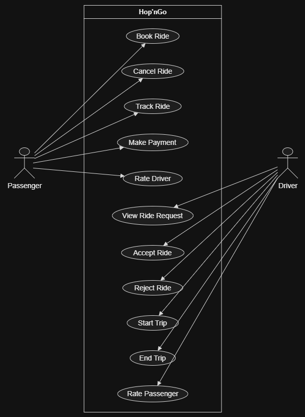
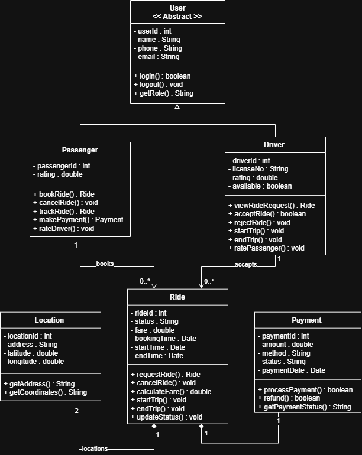
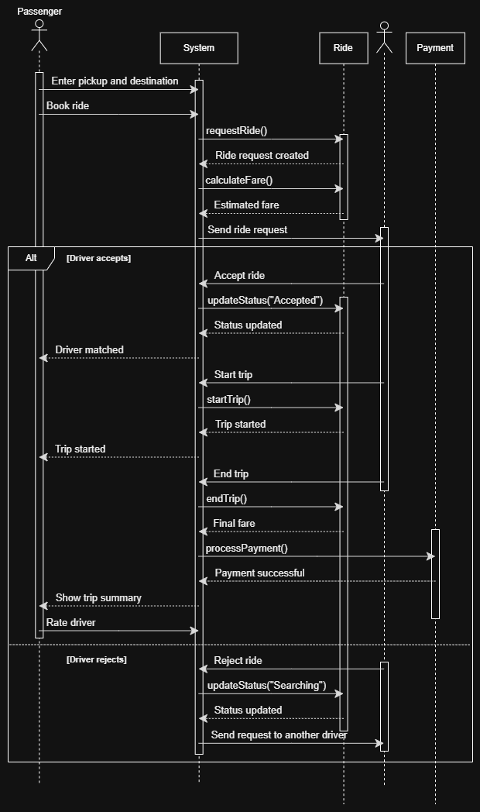
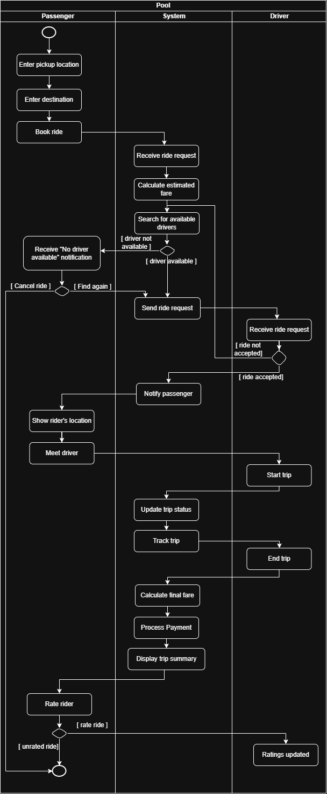

# Hop'nGo – Ride-Hailing System

## Project Description

Hop'nGo is a proposed ride-hailing system designed to connect passengers with available drivers through an organized ride-booking process.

The system addresses the difficulty of finding convenient transportation while providing drivers with an organized way to receive and manage ride requests. Hop'nGo manages the ride process from booking and driver matching to trip completion and payment.

This project focuses on applying object-oriented programming and software design principles using Java and the Spring Boot framework, with MySQL for relational data storage.

### Target Users / Stakeholders

- **Passenger** – Books rides, tracks trips, makes payments, and rates drivers.
- **Driver** – Receives ride requests, accepts or rejects rides, and manages trips.
- **Hop'nGo System** – Coordinates ride requests, driver matching, trip management, and payments.

---

## Objectives

The main objective of Hop'nGo is to provide a simple and organized ride-hailing platform that connects passengers with available drivers.

The system aims to:

- Allow passengers to conveniently book rides.
- Match passengers with available drivers.
- Allow drivers to accept or reject ride requests.
- Manage the complete trip from start to completion.
- Calculate and process ride payments.
- Maintain organized records of users, rides, locations, and payments.
- Provide an efficient workflow for passengers and drivers.
- Apply object-oriented programming and software design principles.

---

## Key Features

### User Management

- User registration and login
- Passenger and driver profiles
- User information management

### Ride Booking

- Enter pickup location
- Enter destination
- Request a ride
- View ride status

### Driver Matching

- Search for available drivers
- Send ride requests to drivers
- Allow drivers to accept or reject ride requests
- Search for another driver when a request is rejected

### Trip Management

- Start a trip
- Track trip status
- End a trip
- Cancel a ride when necessary

### Payment Management

- Calculate estimated and final fare
- Process ride payments
- Record payment information and status

### Rating

- Passenger can rate the driver
- Driver can rate the passenger

---

## Technology Stack

- **Programming Language:** Java
- **Framework:** Spring Boot
- **Build Tool:** Apache Maven
- **Database:** MySQL
- **Database Integration:** Spring Data JPA
- **API Development:** Spring Web
- **Input Validation:** Spring Boot Validation
- **UML Design:** PlantUML
- **Diagram Documentation:** Mermaid
- **Documentation:** Markdown
- **Version Control:** Git and GitHub

---

## Project Structure

```text
HopnGo/
├── src/
│   ├── main/
│   │   ├── java/
│   │   │   └── com/
│   │   │       └── hopngo/
│   │   │           ├── HopnGoApplication.java
│   │   │           ├── controller/
│   │   │           ├── service/
│   │   │           ├── repository/
│   │   │           └── model/
│   │   └── resources/
│   │       └── application.properties
│   └── test/
├── docs/
│   └── uml/
│       ├── HopnGo_use-case-diagram.png
│       ├── HopnGo_class-diagram.png
│       ├── HopnGo_sequence-diagram.png
│       └── HopnGo_activity-diagram.png
├── pom.xml
├── README.md
└── .gitignore
```

### Directory Description

| File / Directory | Description |
|---|---|
| `src/main/java/` | Contains the Java source code. |
| `controller/` | Handles incoming HTTP requests and API responses. |
| `service/` | Contains application logic and business rules. |
| `repository/` | Handles database operations through Spring Data JPA. |
| `model/` | Contains the application's data models and entities. |
| `src/main/resources/` | Contains application configuration files. |
| `src/test/` | Contains automated tests. |
| `docs/uml/` | Contains the four UML diagram images. |
| `pom.xml` | Defines project dependencies and Maven configuration. |
| `README.md` | Provides project documentation. |
| `.gitignore` | Specifies files and directories Git should ignore. |

---

## Setup and Execution Instructions

### Prerequisites

Install the following before running the project:

- Java Development Kit (JDK 21)
- Apache Maven, or use the included Maven Wrapper
- MySQL Server
- Git
- A Java-compatible code editor, such as Visual Studio Code or IntelliJ IDEA

### 1. Clone the Repository

```bash
git clone <repository-url>
cd HopnGo
```

Replace `<repository-url>` with the actual URL of your GitHub repository.

### 2. Create the MySQL Database

Open MySQL Workbench or your MySQL command-line client and execute:

```sql
CREATE DATABASE hopngo;
```

### 3. Configure the Database Connection

Configure the database connection in `src/main/resources/application.properties`.

Example for a local MySQL installation:

```properties
spring.application.name=HopnGo

spring.datasource.url=${DB_URL:jdbc:mysql://localhost:3306/hopngo}
spring.datasource.username=${DB_USERNAME:root}
spring.datasource.password=${DB_PASSWORD}

spring.jpa.hibernate.ddl-auto=update
spring.jpa.show-sql=true
spring.jpa.properties.hibernate.format_sql=true
```

Set the `DB_PASSWORD` environment variable to your MySQL password before starting the application. Avoid committing database credentials to GitHub.

The database settings above assume that the project uses Spring Data JPA and the MySQL JDBC driver.

### 4. Run the Application

Using Maven:

```bash
mvn spring-boot:run
```

Alternatively, if the project includes the Maven Wrapper:

**Windows:**

```powershell
.\mvnw.cmd spring-boot:run
```

**Linux/macOS:**

```bash
./mvnw spring-boot:run
```

The application will start using the configured Spring Boot settings. API endpoints will be available once they have been implemented.

---

## UML Diagrams

The following UML diagrams represent the proposed design of the Hop'nGo ride-hailing system.

### Use Case Diagram

Identifies the main actors and functionalities of the system.



### Class Diagram

Shows the main classes, attributes, methods, and object-oriented relationships.



### Sequence Diagram

Illustrates the interactions involved in the ride-booking process, from requesting a ride to completing payment.



### Activity Diagram

Shows the ride-hailing workflow, including driver availability, ride acceptance, and alternative paths.



---

## Project Status

Hop'nGo is currently in the initial design and development stage. The project includes the planned UML design artifacts and the intended Spring Boot and MySQL technology stack.

The implementation will progressively introduce the application's models, database repositories, services, and REST API controllers.

A fully working system is not required for the initial project submission.